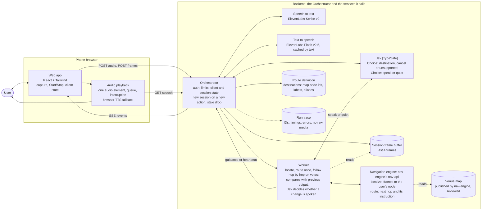
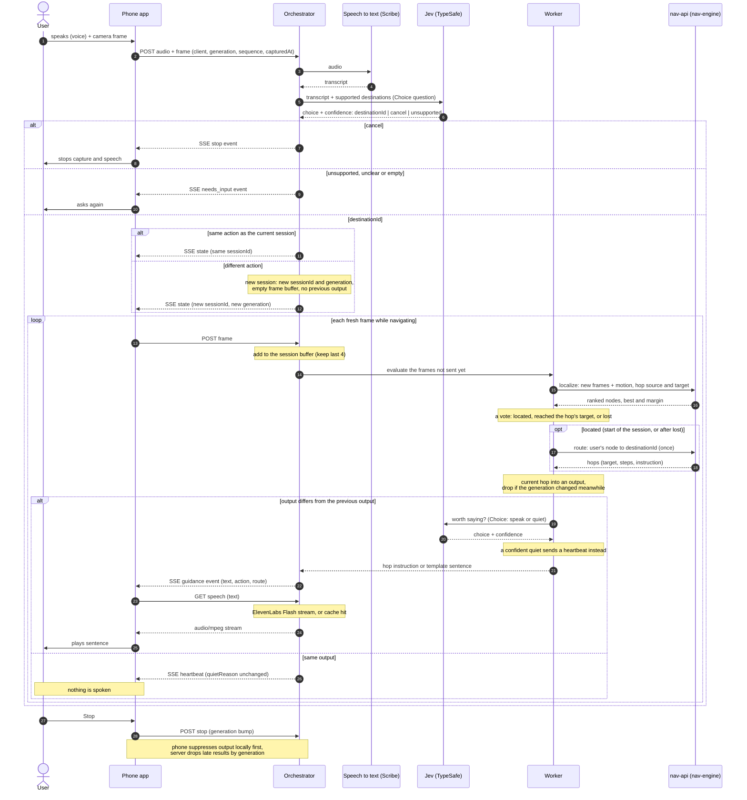

# Architecture: Voice Guidance pipeline

Status: draft for team review. Diagrams are Mermaid, so they render on GitHub and diff cleanly.
Everything here is a proposal. Models and hosting are not decided. Speech in and out is ElevenLabs: Scribe v2 for speech to text, Flash v2.5 for text to speech, both called by the Orchestrator ([contracts.md section 4](contracts.md#4-orchestrator--elevenlabs)). Navigation is nav-engine's **nav-api**, which the Orchestrator calls ([contracts.md section 2](contracts.md#2-orchestrator--navigation-engine), [below](#navigation-engine-nav-engine)). Decisions go through [Jev](https://docs.typesafe.ai/introduction), TypeSafe's decision model: the Command step and the worker's speak-or-quiet question are each one Jev Choice question. Jev does not generate text, so sentences are the route's instructions from nav-api, or templates. HTTP contracts: [contracts.md](contracts.md).

## 1. Context

## 2. Containers

The Orchestrator is the only component the phone talks to. Every model call goes out from it and returns to it, so route validation, stale-response checks and logging live in one place.

A **client** is one phone from Start to Stop. A **session** is one spoken action, such as "go to the counter". A different action starts a new session; the same action keeps the current one.

Legend: `stt` and `ttsapi` (ElevenLabs), `cmd` (Jev, TypeSafe API) and `nav` (nav-engine's nav-api, whose models run on a GPU host) are the model calls. The phone never calls nav-engine. The worker, its comparison rule and the sentence templates are plain code inside the Orchestrator.

## 3. One pass through the pipeline

## Component responsibilities

| Component | Owns | Does not own |
| --- | --- | --- |
| Web app | Mic and camera capture, Start/Stop, client state machine, SSE client, adopting a new session's generation | Any model call, any secret |
| Audio playback | Playing received text through `GET /speech`, queue, interrupt on Stop, dedupe by guidance ID, browser TTS fallback | Deciding what to say |
| Orchestrator | Auth, size limits, client, session and generation tracking, starting a new session on a new action, route validation, SSE out | Model internals |
| Speech to text (ElevenLabs Scribe v2) | Audio to transcript | Meaning of the request |
| Text to speech (ElevenLabs Flash v2.5) | Text to MP3 stream, proxied and cached by the Orchestrator | Wording, timing |
| Jev (TypeSafe) | Turning a transcript into `start(destinationId)`, `cancel` or `unsupported`, and judging whether a changed direction is worth saying, each with a confidence | Route progress, wording |
| Worker | The navigation loop: locating the user with `localize`, one `route`, following it hop by hop on votes, starting over when lost; comparing each output with the session's previous output, choosing guidance or heartbeat | Model internals, the map |
| Navigation engine (nav-engine's nav-api) | Which node of the venue map the frames show (`confirmed`, `uncertain` or `lost`), and the route to the destination with each hop's spoken instruction | The user's position between calls (it is stateless), deciding whether to speak |
| Sentence templates | A fallback sentence per action, when the route hop has no instruction that fits 240 characters | Route validity |
| Route definition | The supported destinations: map node ids, labels and aliases, server-owned | Paths, which come from nav-api |
| Run trace | Sanitized IDs, stage timings and errors | Raw audio or images |

## Navigation engine (nav-engine)

[tungsten-united/nav-engine](https://github.com/tungsten-united/nav-engine) is map-based, not a VLA. The Orchestrator uses it: for every frame it evaluates, the worker calls nav-engine's **nav-api**, `localize` then `route` ([contracts.md section 2](contracts.md#2-orchestrator--navigation-engine)). The phone never calls nav-engine. As of 2026-10-10 it has:

- **Recorder:** a phone page and API (`map-api` on Cloud Run), part of nav-engine's debugging frontend for the team, that records free walks of a place: video, motion sensors, compass, voice notes and tags. Recordings go to `gs://tungsten-united-nav-recordings/recordings/`.
- **Map pipeline:** every walk of a place feeds one semantic topological map. Sharpest frames at 1 fps, steps and heading from the IMU, walked distance from the floor seen in the video, Whisper for voice notes, DINOv2 and MegaLoc embeddings, ALIKED + LightGlue for same-place checks, then a Claude Code job writes nodes and edges with spoken instructions both ways. Code assigns stable ids, distances, headings and reference images (with MegaLoc embeddings, for visual place recognition). A TypeSafe Jev check flags instructions that rely on sight. Models run on a teammate GPU (helium, `nav-infer`) behind a tunnel.
- **Review:** a person verifies, fixes or hides nodes and edges, in the viewer or with `nav map review`, and enters distances measured on site, which set the map's scale. nav-api routes over verified edges unless asked otherwise; the Orchestrator asks for `observed` edges (`NAV_TRUST`) until the demo route is verified.
- **nav-api, for the Orchestrator:** https://nav-api-613464313064.europe-southwest1.run.app, on Cloud Run, read-only on the published maps, with its own bearer token. `POST /maps/{map}/localize` takes 1 to 4 JPEG frames and the last confirmed node, embeds them with MegaLoc on the GPU host, and compares them with the map's reference images: ranked nodes and `confirmed`, `uncertain` or `lost`. `POST /maps/{map}/route` gives the shortest route over trusted edges (Dijkstra), each hop with its steps and spoken instruction. It is stateless: the Orchestrator keeps the last confirmed node and confirms arrival. About 27 ms per frame on the GPU plus the network; the first frame after the GPU host restarts can get a 503. The thresholds are placeholders until tuned on venue images.
- **Reference code, not served:** `pdr.GraphTracker` (step detection and progress towards the next node, with uncertainty). It predicts arrival but needs a visual or user confirmation to advance.
- **Debugging frontend**, served by `map-api` for the team: the recorder, a recordings dashboard, a map viewer, and `/loc/` and `/nav/` pages that test nav-api by hand. Not part of Orient.
- **Map of Itnig:** one walk, 10 nodes (`n1` Main entrance, `n2` Drinks area, `n3` Hackathon tables, `n4` Stage corridor, `n5` Right-side tables, `n6` Corridor end, `n7` Kitchen, `n8` Stage, `n9` Stone wall tables, `n10` Centre tables), 9 edges, all `observed` one way and `inferred` back. None is verified yet.

What it does not have yet: localization tested on a walk the map was not built from, orientation and turn checks, and verified edges. Gaps are open points 9 to 11.

## Open points

1. **Speech to text.** Decided: ElevenLabs Scribe v2, batch, one call per input. Wispr Flow was evaluated and rejected: no self-serve API (see [contracts.md](contracts.md#wispr-flow-evaluated-not-used)).
2. **Worker rule.** Decided: a changed output goes to Jev as one Choice question (speak or quiet), and the same output is spoken again after 7 s ([contracts.md](contracts.md#worker-speak-or-stay-quiet)). Still to measure: the latency the extra call adds.
3. **Text to speech.** Decided: the phone gets text on SSE, then fetches audio from the Orchestrator, which streams ElevenLabs Flash v2.5. Browser TTS is the fallback when that fails. Still to measure on the demo phone: time from `guidance` event to first sound, cached and uncached.
4. **Where the backend runs.** Tunnel to the local GPU server or a Google Cloud service in front of it. Decides who holds the auth secret.
5. **Silent frames.** When the output is unchanged, the server sends a heartbeat or state-only event so the phone can tell "quiet by choice" from "connection lost".
6. **Command classifier runs once per input.** After a session starts, frames go straight to the worker. A new voice command re-enters at step 2.
7. **Each frame once.** `localize` gets the frames not sent before (usually 1), so the votes of consecutive calls are over different frames. nav-api takes 1 to 4 and scores a burst by the mean over its frames.
8. **Navigation contract.** Decided: the Orchestrator calls nav-api's `localize` and `route` ([contracts.md section 2](contracts.md#2-orchestrator--navigation-engine)); orient-orchestrator `main` does since 2026-10-10. Staging releases use the real nav-api by default; ticking `fake_nav` uses the fake navigation engine for one release.
9. **Destinations.** Decided: the Orchestrator's `route.json` lists Itnig map nodes, `n2` Drinks area (also "coffee"), `n7` Kitchen and `n8` Stage, starting at `n1` Main entrance. With `observed` edges, all three are reachable from the entrance, but not back, since the edges were walked one way only. Other spots need to be mapped first.
10. **No verified edges.** nav-api's `route` with `trust: verified` finds no route on the current map, so the Orchestrator routes over `observed` edges, walked once while mapping and never checked. Someone has to walk and verify the demo route in the viewer before S11, then set `NAV_TRUST=verified`.
11. **Localization is untested on held-out walks.** The Itnig map has one walk, and that walk's frames match themselves. nav-api's thresholds (confirm at 0.45 with a 0.05 margin, lost under 0.35) and the loop's votes (3 of 4, margin 0.04) were tuned on the two mapping walks. A second walk of the demo route is needed to tune them before S11.
