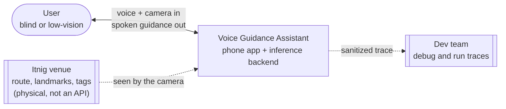
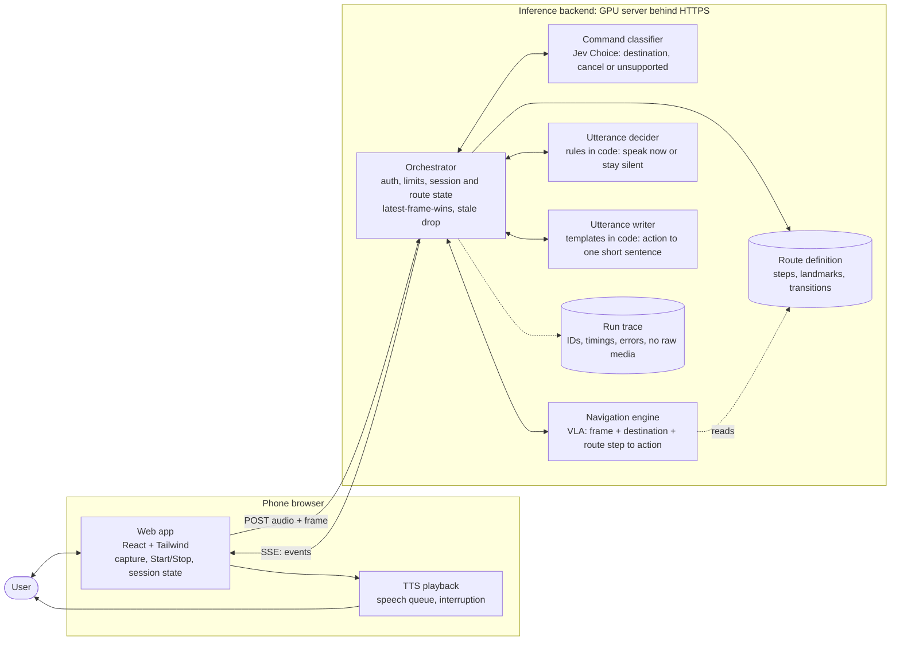
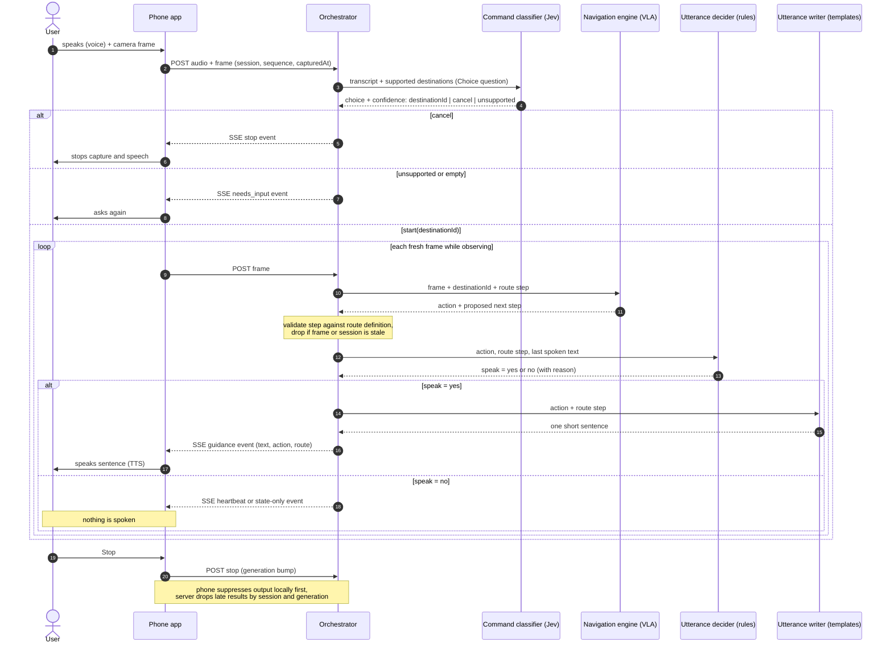

# Architecture: Voice Guidance pipeline

Status: draft for team review. Diagrams are Mermaid, so they render on GitHub and diff cleanly.
Everything here is a proposal. Models, hosting and the exact STT path are not decided. Decisions go through [Jev](https://docs.typesafe.ai/introduction), TypeSafe's decision model: the Command step is one Jev Choice question. Jev does not generate text, so the writer uses templates and the decider uses rules. HTTP contracts: [contracts.md](contracts.md).

## 1. Context

## 2. Containers

The Orchestrator is the only component the phone talks to. Every model call goes out from it and returns to it, so route validation, stale-response checks and logging live in one place.

Legend: `cmd` (Jev, TypeSafe API) and `nav` (VLA) are the model calls. `dec` and `wri` are plain code inside the Orchestrator, drawn separately because each has its own contract.

## 3. One pass through the pipeline

## Component responsibilities

| Component | Owns | Does not own |
| --- | --- | --- |
| Web app | Mic and camera capture, Start/Stop, session state machine, SSE client | Any model call, any secret |
| TTS playback | Speaking received text, queue, interrupt on Stop, dedupe by guidance ID | Deciding what to say |
| Orchestrator | Auth, size limits, session and generation tracking, route validation, calling each model in order, SSE out | Model internals |
| Command classifier (Jev) | Turning a transcript into `start(destinationId)`, `cancel` or `unsupported`, with a confidence | Route progress |
| Navigation engine | Frame + destination + step to a structured action | Wording, deciding whether to speak |
| Utterance decider | Speak or stay silent (new action, changed step, repeat interval, uncertainty) | Writing the sentence |
| Utterance writer (templates) | One sentence of at most 240 characters | Route validity |
| Route definition | Allowed steps and transitions, server-owned | Anything learned at runtime |
| Run trace | Sanitized IDs, stage timings and errors | Raw audio or images |

## Open points

1. **Speech to text.** Jev reads text or JSON, not audio, so an STT step sits between the Orchestrator and `cmd`, or the phone sends a transcript. Which STT is still open.
2. **Decider as rules or Jev.** Start with rules (action changed, step changed, or 5 to 10 seconds since the last utterance). If rules prove too rigid, ask Jev a yes/no (Noul) question. A second model call per frame adds latency.
3. **"TTS command".** Drawn as text sent to the phone, which synthesizes speech. If browser TTS fails on the demo phone, add a server TTS component that returns audio on the same event stream.
4. **Where the backend runs.** Tunnel to the local GPU server or a Google Cloud service in front of it. Decides who holds the auth secret.
5. **Silent frames.** When `speak = no`, the server sends a heartbeat or state-only event so the phone can tell "quiet by choice" from "connection lost".
6. **Command classifier runs once per utterance.** After `start`, frames go straight to the navigation engine. A new voice command re-enters at step 3.
