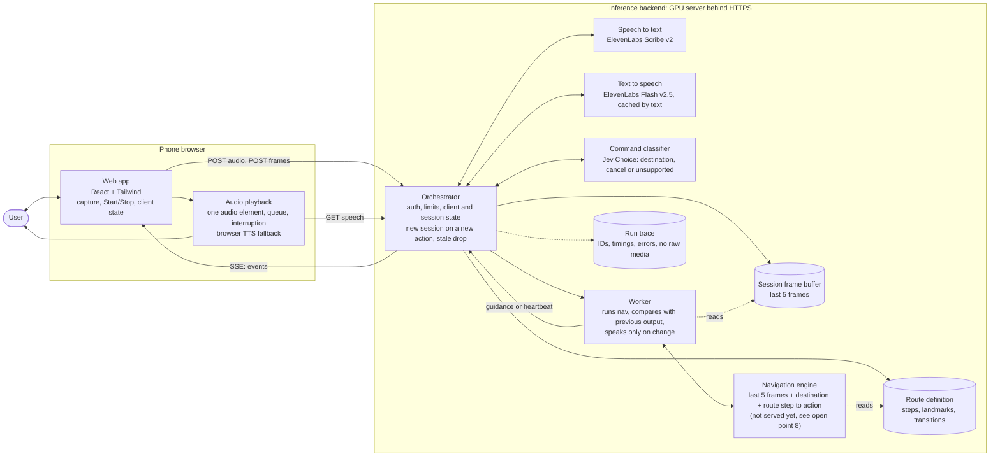
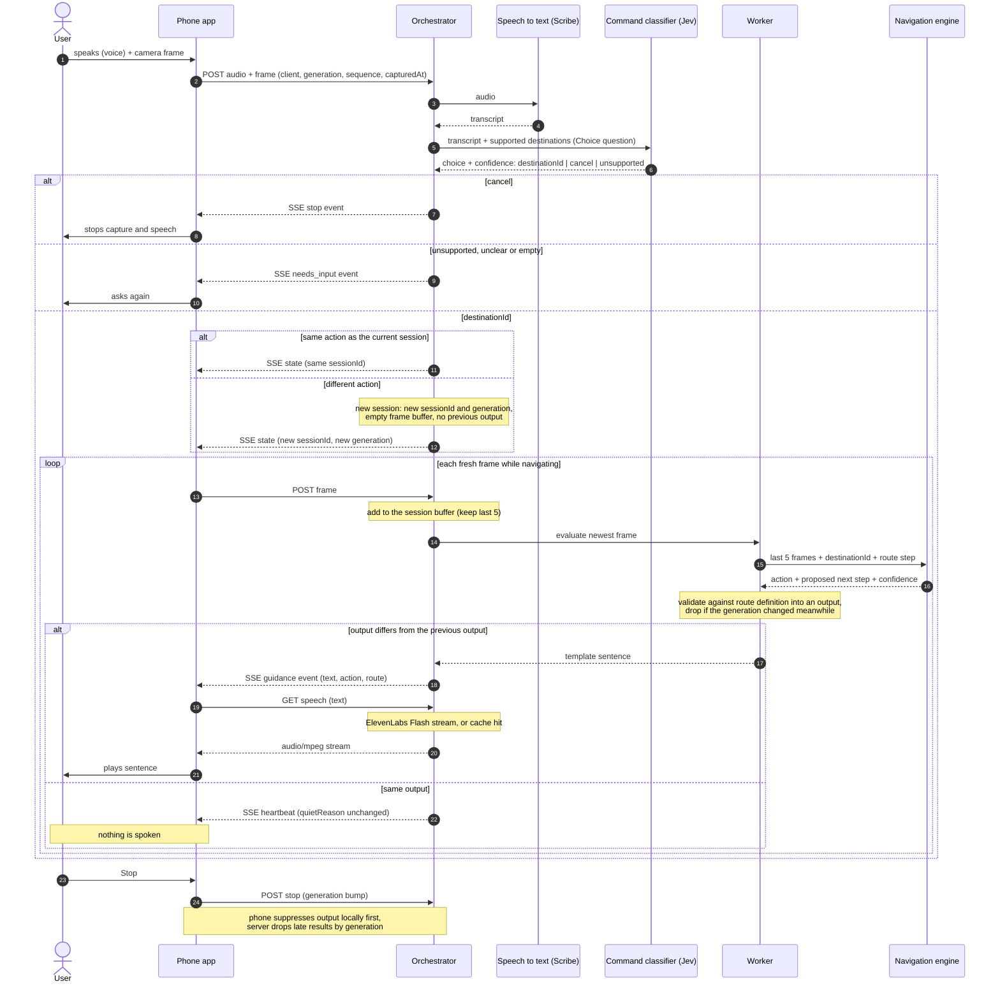

# Architecture: Voice Guidance pipeline

Status: draft for team review. Diagrams are Mermaid, so they render on GitHub and diff cleanly.
Everything here is a proposal. Models and hosting are not decided. Speech in and out is ElevenLabs: Scribe v2 for speech to text, Flash v2.5 for text to speech, both called by the Orchestrator ([contracts.md section 4](contracts.md#4-orchestrator--elevenlabs)). Decisions go through [Jev](https://docs.typesafe.ai/introduction), TypeSafe's decision model: the Command step is one Jev Choice question. Jev does not generate text, so sentences are templates and the worker's speak-or-stay-quiet rule is code. HTTP contracts: [contracts.md](contracts.md).

## 1. Context

## 2. Containers

The Orchestrator is the only component the phone talks to. Every model call goes out from it and returns to it, so route validation, stale-response checks and logging live in one place.

A **client** is one phone from Start to Stop. A **session** is one spoken action, such as "go to the counter". A different action starts a new session; the same action keeps the current one.

Legend: `stt` and `ttsapi` (ElevenLabs), `cmd` (Jev, TypeSafe API) and `nav` (navigation engine) are the model calls. The worker, its comparison rule and the sentence templates are plain code inside the Orchestrator.

## 3. One pass through the pipeline

## Component responsibilities

| Component | Owns | Does not own |
| --- | --- | --- |
| Web app | Mic and camera capture, Start/Stop, client state machine, SSE client, adopting a new session's generation | Any model call, any secret |
| Audio playback | Playing received text through `GET /speech`, queue, interrupt on Stop, dedupe by guidance ID, browser TTS fallback | Deciding what to say |
| Orchestrator | Auth, size limits, client, session and generation tracking, starting a new session on a new action, route validation, SSE out | Model internals |
| Speech to text (ElevenLabs Scribe v2) | Audio to transcript | Meaning of the request |
| Text to speech (ElevenLabs Flash v2.5) | Text to MP3 stream, proxied and cached by the Orchestrator | Wording, timing |
| Command classifier (Jev) | Turning a transcript into `start(destinationId)`, `cancel` or `unsupported`, with a confidence | Route progress |
| Worker | Calling the navigation engine with the last 5 frames, comparing each output with the session's previous output, choosing guidance or heartbeat | Model internals, route definition |
| Navigation engine | Last 5 frames + destination + step to a structured action | Wording, deciding whether to speak |
| Sentence templates | One sentence of at most 240 characters per action | Route validity |
| Route definition | Allowed steps and transitions, server-owned | Anything learned at runtime |
| Run trace | Sanitized IDs, stage timings and errors | Raw audio or images |

## Navigation engine (nav-engine)

[tungsten-united/nav-engine](https://github.com/tungsten-united/nav-engine) is map-based, not a VLA. As of 2026-10-10 it has:

- **Recorder:** a phone web app and API (`nav-api` on Cloud Run) that records free walks of a place: video, motion sensors, compass, voice notes and tags. Recordings go to `gs://tungsten-united-nav-recordings/recordings/`.
- **Map pipeline:** every walk of a place feeds one semantic topological map. Sharpest frames at 1 fps, steps and heading from the IMU, Whisper for voice notes, DINOv2 and MegaLoc embeddings, ALIKED + LightGlue for same-place checks, then a Claude Code job writes nodes and edges with spoken instructions both ways. Code assigns stable ids, distances, headings and reference images (with MegaLoc embeddings, for visual place recognition). A TypeSafe Jev check flags instructions that rely on sight. Models run on a teammate GPU (helium, `nav-infer`) behind a tunnel.
- **Review:** a person verifies, fixes or hides nodes and edges, in the viewer or with `nav map review`. Real users are routed over verified edges only.
- **Live-navigation reference code** (Python, meant to port to TypeScript): `route.plan_route` (Dijkstra over trusted edges) and `pdr.GraphTracker` (step detection and progress towards the next node, with uncertainty). It predicts arrival but needs a visual or user confirmation to advance.
- **Map of Itnig:** one walk, 10 nodes (Main entrance, Drinks area, Hackathon tables, Stage corridor, Right-side tables, Corridor end, Kitchen, Stage, Stone wall tables, Centre tables), 9 edges, all `observed` one way and `inferred` back. None is verified yet.

What it does not have yet: live visual place recognition against the reference images, and any service that answers the orchestrator's `POST /v1/navigate`. Gaps are open points 8 to 10.

## Open points

1. **Speech to text.** Decided: ElevenLabs Scribe v2, batch, one call per input. Wispr Flow was evaluated and rejected: no self-serve API (see [contracts.md](contracts.md#wispr-flow-evaluated-not-used)).
2. **Worker rule.** Speak when the output differs from the previous output, plus a reminder after 7 s of the same output. If that proves too rigid, ask Jev a yes/no (Noul) question. A second model call per frame adds latency.
3. **Text to speech.** Decided: the phone gets text on SSE, then fetches audio from the Orchestrator, which streams ElevenLabs Flash v2.5. Browser TTS is the fallback when that fails. Still to measure on the demo phone: time from `guidance` event to first sound, cached and uncached.
4. **Where the backend runs.** Tunnel to the local GPU server or a Google Cloud service in front of it. Decides who holds the auth secret.
5. **Silent frames.** When the output is unchanged, the server sends a heartbeat or state-only event so the phone can tell "quiet by choice" from "connection lost".
6. **Command classifier runs once per input.** After a session starts, frames go straight to the worker. A new voice command re-enters at step 2.
7. **Fewer than 5 frames.** At the start of a session the navigation engine gets 1 to 4 frames. The navigation engine owner should confirm it handles that, or the worker should wait for 5.
8. **No service answers `POST /v1/navigate`.** nav-engine exposes maps and reference code, not the per-frame contract. Either nav-engine adds `/v1/navigate` (route state from the map, PDR progress, visual confirmation from reference images), or the contract changes so the orchestrator plans with the map itself. Staging uses the fake until then.
9. **Route and map disagree.** The orchestrator's built-in route (`itnig-demo`: `start`, `corridor`, `counter`, `bathroom`) does not match the Itnig map's nodes (Main entrance, Kitchen, Stage, Drinks area…). Pick the demo destinations from the map and generate the orchestrator route from it, or map the missing spots.
10. **No verified edges.** `plan_route` with `trust="verified"` finds no route on the current map. Someone has to walk and verify the demo route in the viewer before S11.
