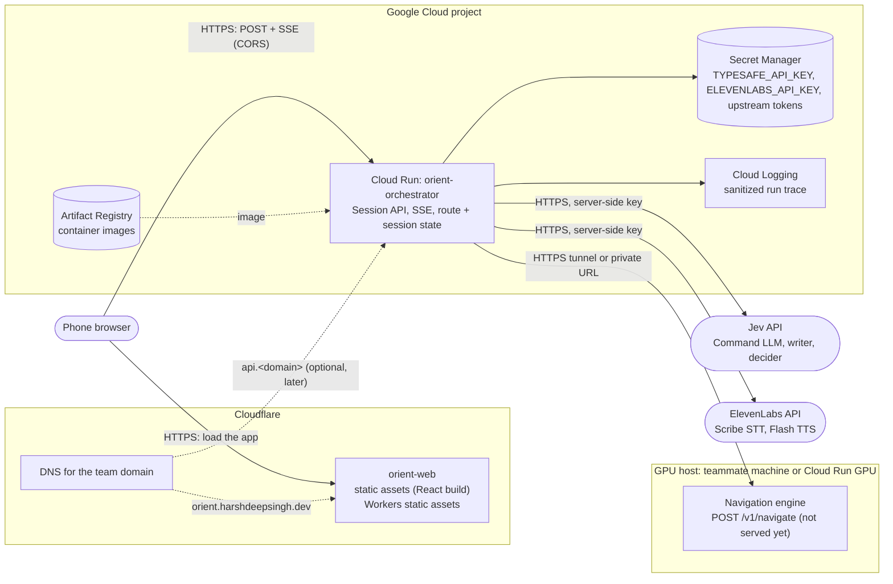
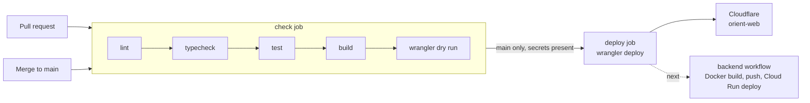

# Deployment architecture

Status: draft for team review. Companion to [architecture.md](architecture.md) (what the components do) and [contracts.md](contracts.md) (what they say to each other). Everything here is a proposal. Research on Cloudflare and Google Cloud was checked against their docs on 9 October 2026; items marked *unverified* were not.

## 1. Where things run

| Piece | Runs on | Why |
| --- | --- | --- |
| Web app (React + Tailwind) | Cloudflare, Workers static assets | Free, global, HTTPS by default (phones need HTTPS for camera and microphone), deploys in seconds. No Worker script: assets only. |
| Orchestrator | Google Cloud Run | Container, HTTPS URL out of the box, request timeout up to 60 minutes for SSE, scales to zero. |
| Navigation engine | `nav-api` on Cloud Run (maps, recordings; team bucket), models on a teammate GPU (helium) behind a tunnel | Free GPU, no cold start. `POST /v1/navigate` is not served yet. Cloud Run GPU is the fallback, see section 5. |
| Decision LLMs | Jev API | As in contracts.md. Key lives only in Secret Manager. |
| Speech to text, text to speech | ElevenLabs API | As in contracts.md section 4. Key lives only in Secret Manager. Usage counts against the budget: check the plan's character and minute quota before demo day. |

## 2. Google Cloud resources

All created by [`infra/gcp/setup.sh`](../infra/gcp/setup.sh) except the service itself, which the backend pipeline creates on first deploy.

| Resource | Name | Purpose |
| --- | --- | --- |
| APIs | `run`, `artifactregistry`, `secretmanager`, `iamcredentials`, `sts`, `logging` | Needed by the rest |
| Artifact Registry | `orient` (Docker, one region) | Orchestrator images |
| Cloud Run service | `orient-orchestrator` | Public HTTPS, unauthenticated at the IAM layer because browsers cannot send IAM tokens. The app's own `sessionToken` protects sessions. Timeout 3600 s, concurrency 80. |
| Service account (runtime) | `orient-orchestrator` | Reads secrets, writes logs. Nothing else. |
| Service account (deploy) | `orient-deployer` | Pushes images and deploys Cloud Run. Used by GitHub Actions only. |
| Workload Identity Federation | pool `github`, provider `github-oidc` | GitHub Actions authenticates with short-lived tokens, restricted to this repository. No JSON keys stored anywhere. |
| Secret Manager | `TYPESAFE_API_KEY`, `ELEVENLABS_API_KEY`, plus the tunnel credential if the navigation engine host needs one | Mounted as env vars on the service |
| Budget alert | set in the Billing console | Not scriptable here without billing admin. Pick a cap that fits the EUR 50 pool and confirm it. |

Service settings to decide when the backend exists:

- **Sessions are in memory** (contracts.md has no database). Run with `--max-instances=1` for the demo so every request for a session reaches the same instance, and `--min-instances=1` on demo day to avoid a cold start mid-demo. Cost of a warm instance: *unverified*, check the pricing page before the demo.
- **Instance-based billing** is worth considering for SSE, since the stream keeps an instance busy anyway. *Unverified* tradeoff: check current Cloud Run pricing.
- **CORS**: Cloud Run has no CORS feature. The orchestrator must answer preflights and send `Access-Control-Allow-Origin` for the web app origin only, and allow `Authorization` and `Content-Type`. This is a requirement for the backend story.

## 3. Domains

You have a domain on Cloudflare. Options for the orchestrator URL, from least to most work:

| Option | What you get | Cost / effort | Verdict |
| --- | --- | --- | --- |
| **`*.run.app` URL** | HTTPS, Google-managed cert, no DNS work | Free, none | **Use this to start.** Fine for development and the demo. |
| Cloud Run **domain mapping**: CNAME `api` to `ghs.googlehosted.com`, DNS only (grey cloud) | `api.<domain>` with a Google-managed cert, direct to Cloud Run, so the 3600 s timeout applies | Free, low | Docs mark it **Preview, not production-ready**, and it exists only in some regions (europe-west1 and us-central1 are listed). Needs the domain verified in Search Console. Good enough for a hackathon if you want a tidy URL. |
| Global external **load balancer** with a serverless NEG | `api.<domain>` via an A record, the production-grade path Google recommends | Monthly cost, high effort | Not for this hackathon. |
| Cloudflare **orange-cloud proxy** to the `run.app` URL | `api.<domain>` through Cloudflare | Free, medium. Needs an Origin Rule to rewrite the Host header, since Cloud Run routes on it. | Avoid for SSE: Cloudflare returns a 524 if the origin sends nothing for about 125 s and this limit is not configurable on non-Enterprise plans. It works only if the server sends a heartbeat every 15 to 30 s. contracts.md already has a 5 s heartbeat, but we should not depend on it. |
| Firebase Hosting rewrite | Custom domain | Cheap | Not recommended: a hard 60 s limit on rewrites to Cloud Run is *unverified* but would break SSE. |

**The web app** gets `https://orient-web.<account>.workers.dev` immediately. A custom name such as `orient.harshdeepsingh.dev` is one line in `apps/web/wrangler.jsonc` (`routes` with `custom_domain: true`) because the zone is already on the same Cloudflare account. Cloudflare creates the DNS record and certificate.

**Recommendation:** web on `orient.harshdeepsingh.dev`, orchestrator on its `run.app` URL, and move to `api.<domain>` through a domain mapping only if a tidy URL matters for the demo. Keeping the two on different origins means CORS must work from day one, which is also what the Cloudflare-to-Cloud-Run split requires.

## 4. CI/CD

Frontend, implemented in [`.github/workflows/web.yml`](../.github/workflows/web.yml):

- Every pull request and every push to `main` runs `npm ci`, lint, typecheck, test, build and a credential-free `wrangler deploy --dry-run`.
- The deploy job runs only on a push to `main`, only after the checks pass, in the `production` GitHub environment. Without Cloudflare credentials it skips with a warning instead of failing, so the pipeline can land before the secrets exist.
- The orchestrator URL is a build-time variable, not a secret.

Backend (next, once `the separate orient-orchestrator repo` has a Dockerfile): authenticate with Workload Identity Federation, build and push to Artifact Registry, deploy to Cloud Run with the runtime service account and secrets mounted. Same trigger: merge to `main` after checks pass. Not written yet because there is nothing to build.

### GitHub configuration

| Kind | Name | Used by | Notes |
| --- | --- | --- | --- |
| Secret | `CLOUDFLARE_API_TOKEN` | web deploy | Token with *Edit Cloudflare Workers* permission, scoped to your account |
| Secret | `CLOUDFLARE_ACCOUNT_ID` | web deploy | An identifier, stored as a secret for convenience |
| Variable | `VITE_API_BASE_URL` | web build | The `run.app` URL, once it exists. Empty means the in-browser demo mode. |
| Variable | `WEB_URL` | deploy job | Shown on the deployment |
| Variables | `GCP_PROJECT_ID`, `GCP_REGION`, `GCP_WORKLOAD_IDENTITY_PROVIDER`, `GCP_DEPLOYER_SA`, `GCP_RUNTIME_SA` | backend deploy | Printed by `setup.sh`. Identifiers, not secrets. |

Secrets go in with `gh secret set <NAME>`, which prompts for the value and does not echo it. Never paste them into a chat, a file or a commit.

## 5. Where the GPU lives

| | Teammate GPU behind a tunnel | Cloud Run with an L4 GPU |
| --- | --- | --- |
| Cost | Free | Billed for the whole instance lifetime, including idle minimum instances |
| Cold start | None | Instance starts in seconds, plus model load time. `min-instances=1` avoids it at continuous cost. |
| Reliability | Depends on laptop power, venue Wi-Fi and the tunnel | Managed |
| Constraints | None | L4 listed for a few regions (europe-west1 and europe-west4 among them). 4 vCPU and 16 GiB minimum, default quota of 3 GPUs per region. Check GA status and pricing first: *unverified*. |

Keep the tunnel for now, as agent.md recommends. Move to Cloud Run GPU only if the tunnel proves unreliable, since it spends the budget. The navigation contract (`POST /v1/navigate`) is the same either way, so the orchestrator does not change.

## 6. Open decisions

1. **GCP region.** `setup.sh` defaults to `europe-west1`, which is in the domain-mapping list. Confirm with the team, and check it matches the project's constraints.
2. **Custom names.** Pick `orient.harshdeepsingh.dev` and whether you want `api.<domain>`.
3. **Single instance.** Accept `max-instances=1` for the demo, or add a shared store.
4. **Budget cap.** Confirm the EUR 50 pool and who owns the billing alert.
5. **Production environment protection.** Add a required reviewer on the `production` GitHub environment if you want a gate before deploys.
